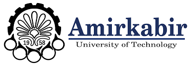
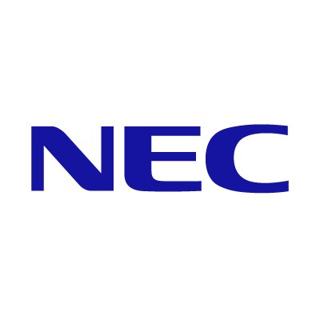

## Welcome to SdSVC 2020

SdSVC is intended to push the field towards...

### Schedule

- December, 2019          Release of Evaluation plan
- December, 2019          Evaluation platform open
- December, 2019          Release of train, development and evaluation sets 
- February, 2019          Challenge deadline
- Early March, 2020       Post-challenge evaluation
- 30 March, 2020          Interspeech submission deadline
- 14/18 Sep, 2020         SdSV challenge 2020 special session at Interspeech

### Workshop

A workshop will be held to announce the challenge winners as well as for presentation of the most novel submissions to ScSVC 2020. Registration details coming up soon.

### Register

Registration info and codalab link

### Organizers

- Hossein Zeinali, Amirkabir University of Technology (AUT), Tehran, Iran
- Kong-Aik Lee, NEC, Japan
- Jahangir Alam, Computer Research Institute of Montreal (CRIM), Canada
- Lukáš Burget, Brno University of Technology (BUT), Czech Republic

 
 
